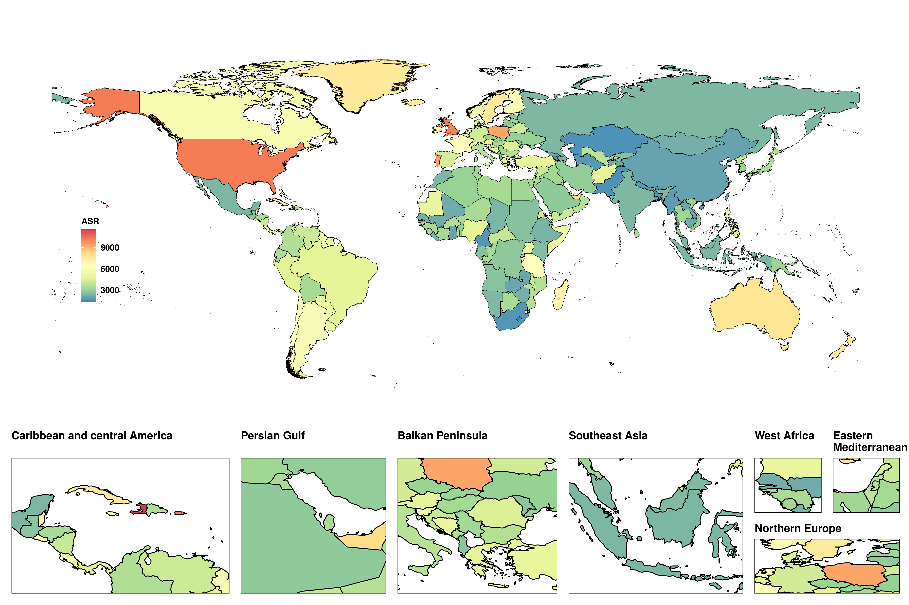
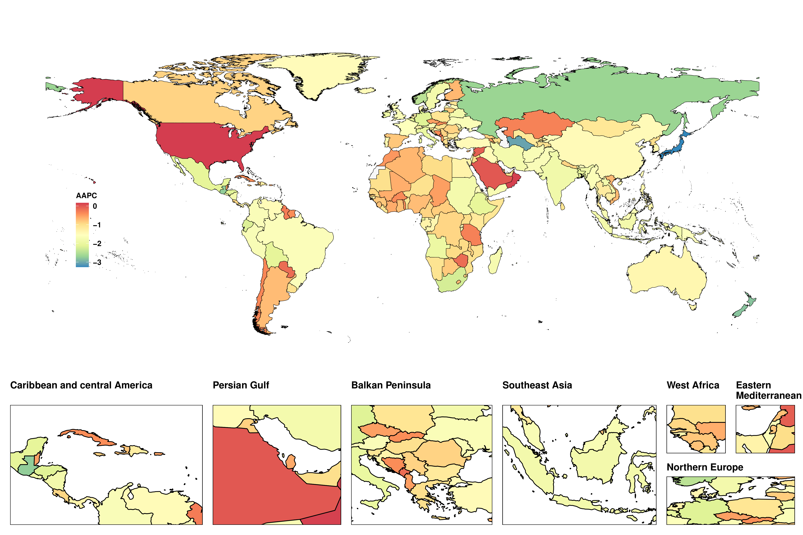
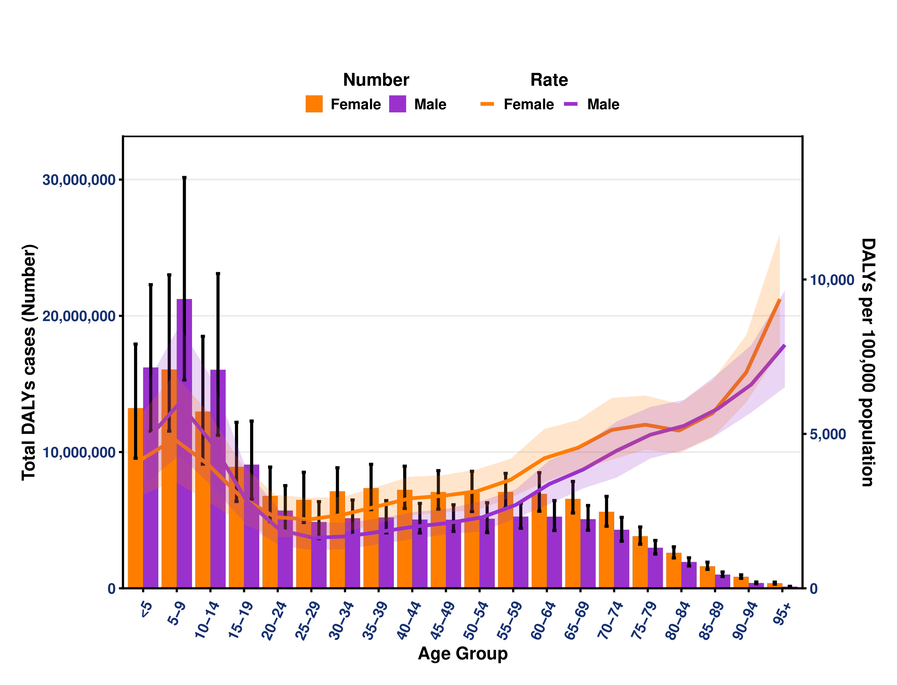
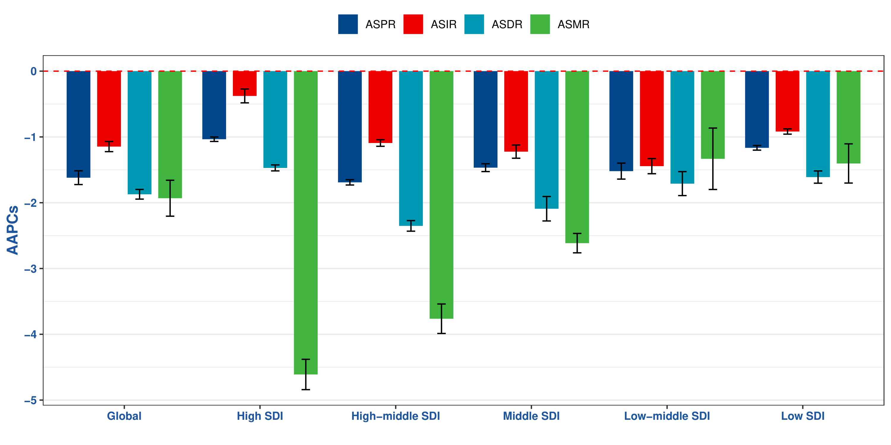
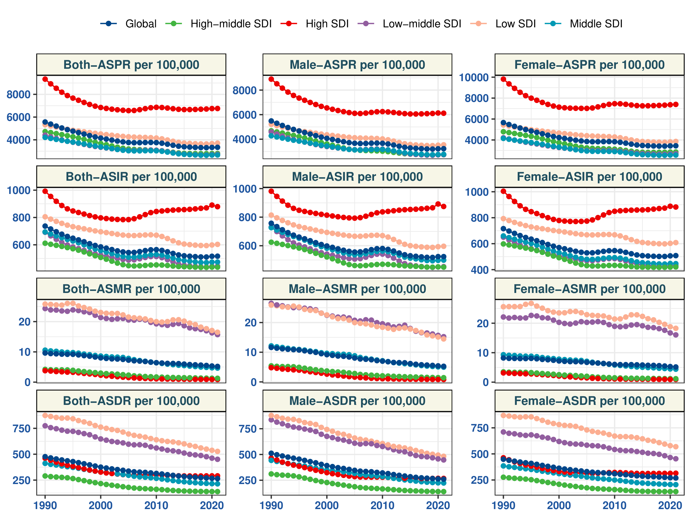
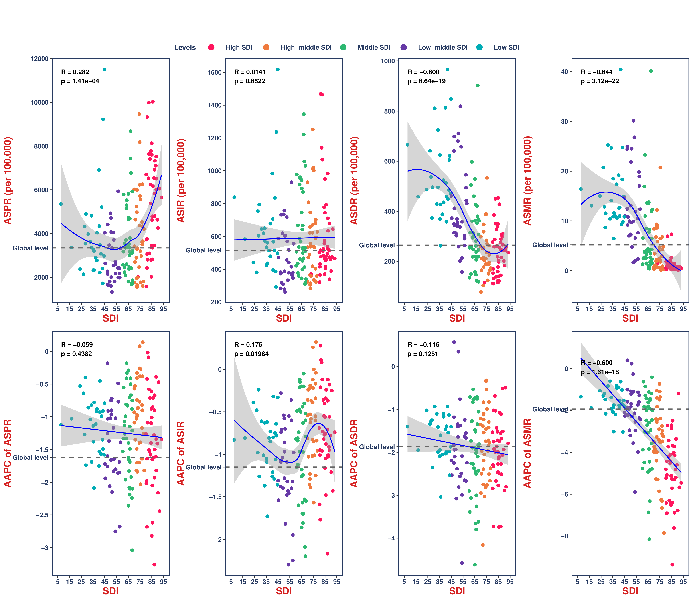
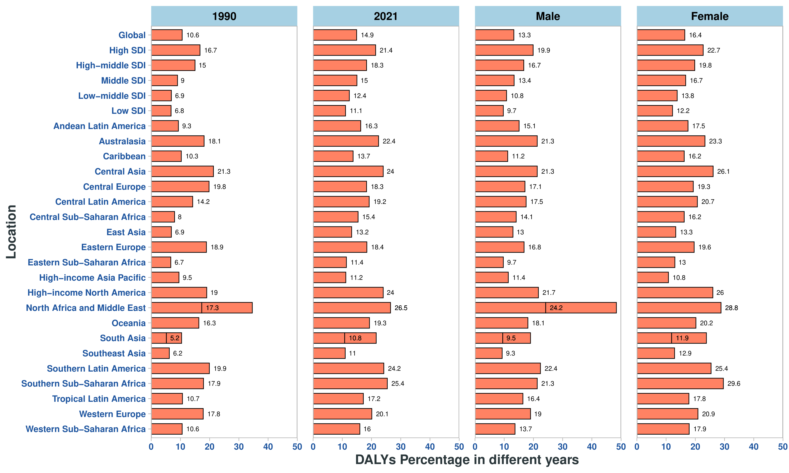
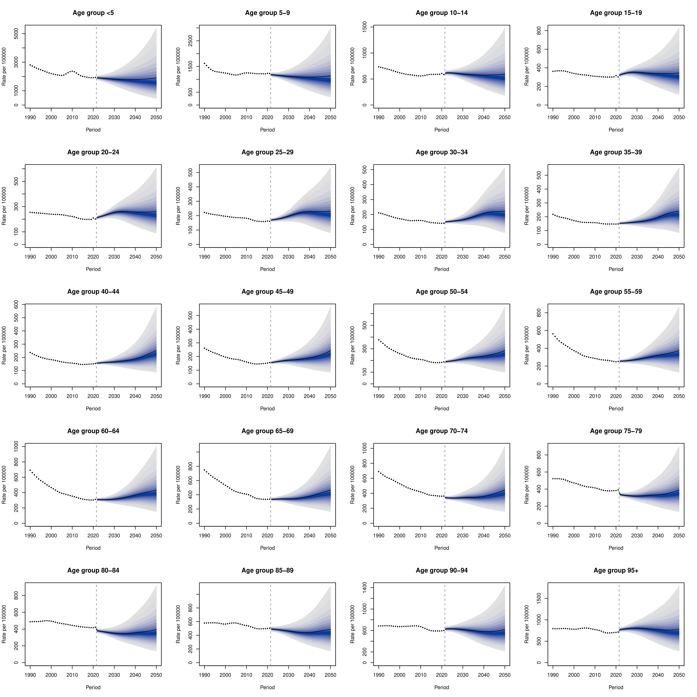
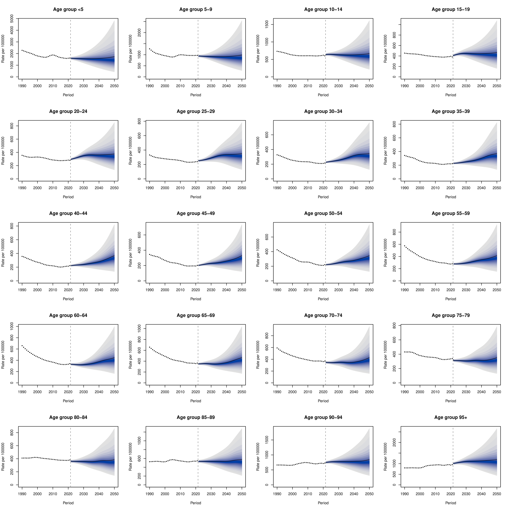

# Global, Regional, and National Burden of Asthma, 1990–2021

## GBD 2021 Output Sample

This portfolio sample summarizes selected outputs from a Global Burden of Disease (GBD)-based analysis of asthma burden from 1990 to 2021, with projected incidence patterns to 2050.

The aim of this sample is to demonstrate interpretation of GBD epidemiological outputs, including age-standardized burden indicators, temporal trends, geographic distribution, socio-demographic gradients, age/sex burden patterns, attributable risk factors, and projection outputs.

Mendelian randomization outputs were intentionally excluded from this portfolio sample.

---

## Study Overview

The analysis evaluated asthma burden using GBD 2021 estimates across global, regional, and national levels. The main outcomes included incidence, prevalence, mortality, and disability-adjusted life years (DALYs). Temporal trends were summarized using average annual percent change (AAPC), while burden patterns were examined by geography, age, sex, and socio-demographic index (SDI). Projection outputs were generated using a Bayesian age-period-cohort framework.

---

## Abbreviations

| Abbreviation | Meaning                          |
| ------------ | -------------------------------- |
| ASIR         | Age-standardized incidence rate  |
| ASPR         | Age-standardized prevalence rate |
| ASMR         | Age-standardized mortality rate  |
| ASDR         | Age-standardized DALY rate       |
| DALYs        | Disability-adjusted life years   |
| AAPC         | Average annual percent change    |
| SDI          | Socio-demographic index          |
| BAPC         | Bayesian age-period-cohort       |

---

# Results

## 1. Global Burden Trend, 1990–2021

Globally, asthma burden declined across all four age-standardized indicators between 1990 and 2021. The global AAPC values were negative for incidence, prevalence, mortality, and DALYs, indicating a broad reduction in standardized asthma burden over time.

| Indicator | Global AAPC |
| --------- | ----------: |
| ASIR      |      -1.147 |
| ASPR      |      -1.619 |
| ASMR      |      -1.932 |
| ASDR      |      -1.872 |

The global prevalence rate decreased from **5,568 per 100,000 population in 1990** to **3,340 per 100,000 population in 2021**. Similarly, the DALY rate decreased from **476 per 100,000 population** to **265 per 100,000 population** over the same period.

This indicates that although asthma remains a common chronic respiratory disease, the age-standardized global burden has generally improved over the last three decades.

---

## 2. Regional Ranking of Asthma Burden in 2021

The top-ranked regions differed by burden indicator. High-income North America showed the highest age-standardized incidence and prevalence-related burden, whereas Oceania had the highest mortality and DALY-related burden.

### Table 1. Top Three Regions by Age-Standardized Rates in 2021

| Indicator  | Location                   | ASR (95% uncertainty interval) | AAPC (95% confidence interval) |
| ---------- | -------------------------- | -----------------------------: | -----------------------------: |
| Incidence  | High-income North America  |      1403.64 (1137.64–1766.66) |       -0.017 (-0.221 to 0.187) |
|   | Caribbean                  |      1193.84 (1000.88–1445.97) |     -0.282 (-0.309 to -0.256)* |
|   | Central Europe             |        898.73 (725.29–1136.93) |        0.034 (-0.076 to 0.144) |
| Prevalence | High-income North America  |     9717.74 (8485.10–11226.93) |        0.088 (-0.014 to 0.191) |
|  | Australasia                |      7747.21 (6479.30–9107.51) |     -1.652 (-1.784 to -1.519)* |
|  | Caribbean                  |      7638.48 (6722.22–8563.44) |     -0.624 (-0.688 to -0.559)* |
| Deaths     | Oceania                    |            33.98 (24.05–51.08) |     -1.027 (-1.075 to -0.979)* |
|      | South Asia                 |            17.68 (12.55–26.32) |     -1.352 (-1.880 to -0.822)* |
|      | Central Sub-Saharan Africa |             15.79 (8.99–37.27) |     -1.210 (-1.306 to -1.114)* |
| DALYs      | Oceania                    |        847.59 (626.75–1212.54) |     -1.157 (-1.224 to -1.089)* |
|       | Central Sub-Saharan Africa |         491.68 (337.41–909.34) |     -1.484 (-1.588 to -1.380)* |
|       | Caribbean                  |         468.60 (349.60–628.75) |     -1.038 (-1.145 to -0.930)* |

* Statistically significant AAPC.

### Results interpretation

High-income North America ranked first for both asthma incidence and prevalence, indicating a high measured burden of disease occurrence. However, the highest mortality and DALY rates were observed in Oceania, not in the regions with the highest prevalence. This suggests a clear separation between **disease occurrence** and **disease outcome severity**.

The regional pattern indicates that high-prevalence regions may not necessarily carry the highest mortality burden. In contrast, regions such as Oceania and Central Sub-Saharan Africa show a more severe outcome profile, reflected by high ASMR and ASDR. This distinction is important when interpreting GBD outputs because prevalence may reflect diagnosis and disease detection, while mortality and DALYs reflect severity, access to care, disease control, and outcome burden.

---

## 3. Countries and Regions with Increasing Burden Trends

Although the global age-standardized burden declined overall, several countries and regions showed increasing AAPC values for specific indicators.

### Table 2. Countries and Regions with Increasing AAPC, 1990–2021

| Indicator | Location                 | AAPC (95% confidence interval) |
| --------- | ------------------------ | -----------------------------: |
| ASIR      | Oman                     |            0.317 (0.245–0.388) |
|       | Poland                   |            0.284 (0.187–0.381) |
|       | Barbados                 |            0.256 (0.164–0.347) |
|       | Saudi Arabia             |            0.111 (0.043–0.180) |
|       | Bermuda                  |            0.084 (0.054–0.114) |
| ASPR      | Oman                     |            0.138 (0.061–0.216) |
|       | United States of America |            0.155 (0.069–0.241) |
| ASMR      | Zimbabwe                 |            0.396 (0.033–0.760) |
| ASDR      | Zimbabwe                 |            0.567 (0.309–0.825) |
|       | Lesotho                  |            0.351 (0.146–0.557) |

### Results interpretation

The increasing ASIR values in Oman, Poland, Barbados, Saudi Arabia, and Bermuda suggest that incident asthma burden did not decline uniformly across all locations. Oman showed the largest increase in ASIR, followed by Poland and Barbados.

The United States showed an increase in ASPR, indicating a rising prevalence burden despite the overall global decline. This finding is consistent with the need to interpret prevalence separately from incidence and mortality, as increasing prevalence may reflect increased diagnosis, survival, chronic disease persistence, or changes in exposure patterns.

More concerning are the increases in ASMR and ASDR observed in Zimbabwe, and the increase in ASDR in Lesotho. Unlike increases in incidence or prevalence, increases in mortality and DALYs indicate worsening outcome burden. These signals are more relevant for health-system prioritization because they suggest potential gaps in asthma control, access to care, acute management, or long-term disease prevention.

---

## 4. Geographic Distribution of Asthma Prevalence

### Figure 1. Global asthma age-standardized prevalence rate in 2021

File: `asthma_prevalence_map_2021.png`

### Results interpretation

The prevalence map shows substantial geographic heterogeneity in asthma burden. The highest age-standardized prevalence rates were concentrated in countries such as Haiti, the United States, and the United Kingdom, while lower prevalence estimates were observed across several parts of Africa and Asia.

This spatial pattern suggests that asthma prevalence is not distributed uniformly and may be influenced by diagnostic capacity, environmental exposures, urbanization, healthcare access, and reporting quality. The map also supports the interpretation that high measured prevalence is more common in several high-income or highly urbanized settings.

---

## 5. Geographic Distribution of AAPC in Prevalence

### Figure 2. AAPC of asthma age-standardized prevalence rate, 1990–2021

File: `asthma_prevalence_aapc_map_1990_2021.png`

### Results interpretation

The AAPC map demonstrates that the direction and magnitude of change in asthma prevalence varied widely across countries. While many countries experienced declining ASPR over time, several countries showed stable or increasing patterns.

The increasing burden observed in Poland and the United States is particularly relevant because these countries were also highlighted as requiring attention due to increasing asthma burden over the study period. This figure adds a temporal layer to the prevalence map, showing that a country’s current burden and its long-term trajectory may not always align.

---

## 6. Age- and Sex-Specific DALY Burden

### Figure 3. Number and rate of asthma DALYs by age and sex in 2021

File: `asthma_dalys_age_sex_2021.png`

### Results interpretation

The DALY distribution showed a bimodal age pattern. In absolute DALY counts, the male burden peaked in children aged 5–9 years, while the female burden peaked in adults aged 55–59 years. The study reported that males had their highest DALY count at ages 5–9 years, reaching 924,212 DALYs, while females had their highest DALY count at ages 55–59 years, reaching 856,216 DALYs.

The rate curves show that DALY rates rise again in older age groups, particularly among the elderly. This indicates that pediatric asthma contributes substantially to total population burden, while older adults carry a high rate-based burden, likely reflecting disease severity, comorbidity, and vulnerability to adverse outcomes.

The sex pattern also changes by age. Younger age groups show a higher male burden, whereas the female burden becomes more prominent in adulthood. This supports the need for age- and sex-specific interpretation rather than relying only on total global estimates.

---

## 7. AAPC Patterns by SDI Level

### Figure 4. AAPC values by SDI group for ASPR, ASIR, ASDR, and ASMR

File: `asthma_aapc_by_sdi_bar_chart.png`

### Results interpretation

The AAPC bar chart shows that all four asthma burden indicators generally declined across the global population and across SDI strata. However, the magnitude of decline differed by indicator and SDI group.

Mortality-related indicators showed stronger declines in higher-SDI settings. In high-SDI regions, ASMR showed a marked decline, consistent with improved asthma management, better access to healthcare, and more effective prevention of fatal outcomes.

In contrast, low-SDI and low-middle-SDI settings showed a different burden profile, with lower measured prevalence and incidence but higher mortality and DALY burden. This implies that lower measured occurrence does not necessarily mean lower clinical or public-health severity.

---

## 8. Temporal Trends by SDI Level and Sex

### Figure 5. Temporal trends of asthma burden indicators by SDI level and sex, 1990–2021

File: `asthma_sdi_temporal_trends.png`

### Results interpretation

The SDI-stratified temporal trends show that high-SDI regions consistently had the highest ASIR and ASPR, while low-SDI regions had the highest ASMR and ASDR. This indicates that asthma is more frequently measured or diagnosed in high-SDI settings, but fatal and disabling outcomes are more concentrated in lower-SDI settings.

In 2021, low-SDI regions had an ASDR of 527.4 per 100,000 and an ASMR of 16.5 per 100,000. In contrast, high-SDI regions had lower mortality and DALY rates despite higher incidence and prevalence.

The most pronounced decline in ASMR occurred in high-SDI regions, decreasing from 4.8 per 100,000 in 1990 to 0.9 per 100,000 in 2021. The largest decline in ASIR was observed in low-middle-SDI regions, where ASIR decreased from 730.7 per 100,000 in 1990 to 443.6 per 100,000 in 2021.

These trends indicate that asthma burden should be interpreted along two axes: disease occurrence and disease outcome. High-SDI settings show greater occurrence burden, whereas low-SDI settings show greater severity and outcome burden.

---

## 9. Association Between SDI and Asthma Burden

### Figure 6. SDI correlation analysis for asthma burden indicators

File: `asthma_sdi_correlation_scatter.png`

### Results interpretation

The SDI correlation figure shows divergent relationships between development level and asthma burden indicators.

ASPR was positively associated with SDI, suggesting that measured asthma prevalence increases with socio-demographic development. ASIR showed no strong linear relationship with SDI in the uploaded figure. In contrast, ASDR and ASMR were strongly negatively associated with SDI, indicating that mortality and disability burden decrease as SDI increases.

| Indicator    | Correlation with SDI |      P value | Interpretation                                            |
| ------------ | -------------------: | -----------: | --------------------------------------------------------- |
| ASPR         |            R = 0.282 | p = 1.41e-04 | Higher SDI was associated with higher measured prevalence |
| ASIR         |           R = 0.0141 |   p = 0.8522 | No clear linear association with incidence                |
| ASDR         |           R = -0.600 | p = 8.64e-19 | Higher SDI was associated with lower DALY burden          |
| ASMR         |           R = -0.644 | p = 3.12e-22 | Higher SDI was associated with lower mortality burden     |
| AAPC of ASPR |           R = -0.059 |   p = 0.4382 | No significant association                                |
| AAPC of ASIR |            R = 0.176 |  p = 0.01984 | Weak positive association                                 |
| AAPC of ASDR |           R = -0.116 |   p = 0.1251 | No significant association                                |
| AAPC of ASMR |           R = -0.600 | p = 1.61e-18 | Strong negative association                               |

The most important finding is the contrast between prevalence and outcome burden. Higher-SDI settings show higher measured prevalence but lower mortality and DALY rates. This likely reflects better diagnosis, better long-term control, greater access to medications, and stronger healthcare systems. Conversely, lower-SDI settings may have underdiagnosis but worse clinical outcomes once asthma occurs.

---

## 10. High BMI-Attributable Asthma DALYs

### Figure 7. Proportion of asthma DALYs attributable to high BMI by region, year, and sex

File: `asthma_high_bmi_attribution.png`

### Results interpretation

The risk-attribution figure shows that high BMI became a more important contributor to asthma-related DALYs between 1990 and 2021. Globally, the proportion of asthma DALYs attributable to high BMI increased from 10.6% in 1990 to 14.9% in 2021.

High BMI-attributable DALYs were higher among females than males globally. The global attributable fraction was 16.4% among females and 13.3% among males. Regionally, the high-BMI contribution varied substantially, ranging from 10.8% to 26.5% across regions in 2021.

The largest increase was observed in North Africa and the Middle East, where the attributable proportion rose from 17.3% in 1990 to 26.5% in 2021. This pattern indicates a growing role for metabolic risk factors in asthma burden, particularly in regions undergoing lifestyle and nutritional transitions.

These results support the interpretation that asthma prevention strategies should not be limited to respiratory exposures alone. Weight control and metabolic risk reduction may also be relevant for reducing asthma-related disability burden.

---

## 11. BAPC Projection of Asthma Incidence in Males

### Figure 8. BAPC projection of asthma incidence among males, 2022–2050

File: `asthma_bapc_projection_male.png`

### Results interpretation

The male BAPC projection indicates that age-specific asthma incidence is expected to remain clinically relevant through 2050. In several adult age groups, particularly from approximately 20 to 80 years, the projected incidence shows a slight upward trend after 2022.

The widening prediction intervals over time indicate increasing uncertainty as the projection horizon extends. This is expected in long-term forecasting and should be interpreted cautiously. Nevertheless, the projected persistence of asthma incidence supports the need for continued prevention, diagnosis, and long-term management strategies.

---

## 12. BAPC Projection of Asthma Incidence in Females

### Figure 9. BAPC projection of asthma incidence among females, 2022–2050

File: `asthma_bapc_projection_female.png`

### Results interpretation

The female BAPC projection shows a broadly similar pattern to the male projection, with asthma incidence expected to remain an important burden across multiple age groups through 2050. Adult age groups show persistent projected incidence, while uncertainty increases with longer projection periods.

Together, the male and female BAPC outputs suggest that asthma will continue to represent a long-term public-health burden, even though several historical age-standardized indicators declined between 1990 and 2021.

---

# Integrated Results Summary

This GBD asthma output sample demonstrates that the global age-standardized burden of asthma declined between 1990 and 2021, but the burden remained heterogeneous across regions, countries, SDI levels, age groups, and sex groups.

The main results can be summarized as follows:

1. **Global standardized burden declined**, with negative AAPC values for ASIR, ASPR, ASMR, and ASDR.

2. **High-income North America had the highest incidence and prevalence-related burden**, while **Oceania had the highest mortality and DALY-related burden**, indicating that occurrence burden and outcome burden are geographically distinct.

3. **Several countries showed increasing AAPC values**, including Oman, Poland, Barbados, Saudi Arabia, and Bermuda for ASIR; the United States for ASPR; Zimbabwe for ASMR and ASDR; and Lesotho for ASDR.

4. **The DALY burden showed important age and sex differences**, with high absolute burden in children and increasing rate-based burden in older adults.

5. **SDI was strongly related to asthma outcome burden**. Higher SDI was associated with higher measured prevalence but lower mortality and DALY rates, while lower SDI settings showed higher severity and outcome burden.

6. **High BMI became a more prominent contributor to asthma-related DALYs**, rising globally from 10.6% in 1990 to 14.9% in 2021, with higher attributable burden in females and substantial regional variation.

7. **BAPC projections suggest persistent future incidence burden**, particularly across adult age groups through 2050.

Overall, the results support a public-health interpretation in which asthma burden is improving globally in standardized terms, but not uniformly. Regions with high prevalence require long-term disease management strategies, while regions with high mortality and DALY burden require improved access to diagnosis, treatment, and acute care. The increasing contribution of high BMI also suggests that metabolic and lifestyle risk reduction may become increasingly relevant to asthma burden control.

---
